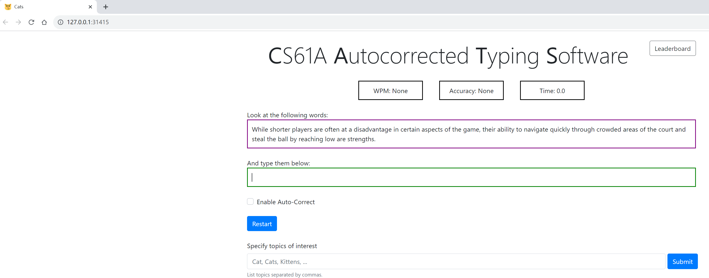

# Text Auto-correction Module

## Introduction

The Text Analytics and Autocorrection Module is a Python-based program aimed at measuring typing speed and implementing a typing autocorrect feature. The module performs text classification tasks, keyword matching, and provides real-time analytics for typing speed and accuracy.

[Watch my implementation on YouTube](https://youtu.be/ENGe_OFuRbk)

## Technologies Used
- Python
- Dynamic Programming
- Edit Distance Algorithms
- Memoization
  
## Features

### Text Classification
- Achieves up to 90% accuracy in classifying text into various categories.
- Utilizes basic natural language processing techniques.

### Autocorrection
- Implements dynamic programming and edit distance algorithms.
- Optimized for fast execution using memoization techniques.

### Typing Metrics
- Real-time calculation of Words Per Minute (WPM) and accuracy.
- Multiplayer progress tracking and competitive typing metrics.

## Implementation Details

### Text Classification & Keyword Matching
- The `choose` and `about` functions help in selecting paragraphs that match a given set of keywords.

### Typing Speed and Accuracy Analytics
- The `accuracy` function calculates the percentage of words typed correctly compared to a reference string.
- The `wpm` function calculates words-per-minute based on the elapsed time and typed content.

### Autocorrection Mechanism
- The `autocorrect` function finds the closest matching word from a set of valid words based on a provided difference function and a limit.

### Utilitarian Functions
- Functions from the `utils` module are used for string manipulation like converting to lowercase, removing punctuation, etc.

### Additional Highlights
- **Flexibility**: The architecture allows easy integration of additional features or different difference functions.
- **Efficiency**: Utilizes Python's list comprehensions and `min()` function for efficient operations.

## Acknowledgements

This project was created as part of online coursework at [UC Berkeley](https://inst.eecs.berkeley.edu/~cs61a/su20/proj/cats/). Special thanks to UC Berkeley for providing the opportunity and inspiration for this project.

