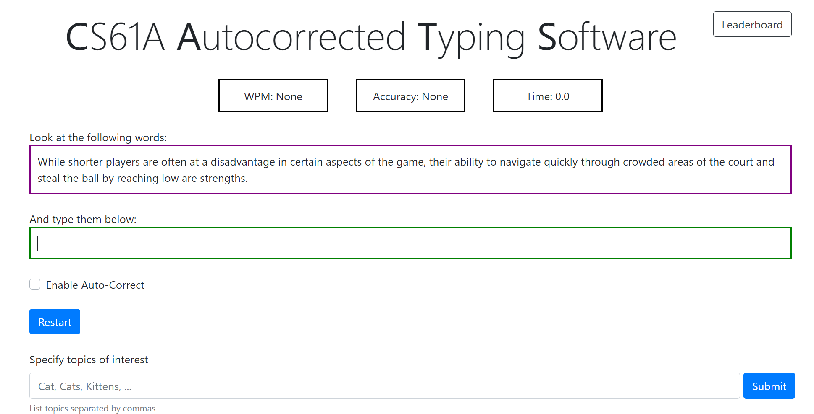

# Text Auto-correction Module

## Introduction

The Text Analytics and Autocorrection Module is a Python-based program aimed at measuring typing speed and implementing a typing autocorrect feature. The module performs text classification tasks, keyword matching, and provides real-time analytics for typing speed and accuracy.

[Watch my implementation on YouTube](https://youtu.be/ENGe_OFuRbk)

## Features

### Text Classification
- Achieves up to 90% accuracy in classifying text into various categories.
- Utilizes basic natural language processing techniques.

### Autocorrection
- Implements dynamic programming and edit distance algorithms.
- Optimized for fast execution using memoization techniques.

### Typing Metrics
- Real-time calculation of Words Per Minute (WPM) and accuracy.
- Multiplayer progress tracking and competitive typing metrics.

## Technologies Used
- Python
- Dynamic Programming
- Edit Distance Algorithms
- Memoization

## Implementation of Elevator Simulation Project

This Python project simulates the operations of elevators within a multi-story building.

### Core Features
- Various elevator classes (`BasicElevator`, `ExpressElevator`, `FreightElevator`) are tailored for specific operations and capacities.
- Uses a `PriorityQueue` for efficient scheduling of elevator stops based on location, destination, and priority level of elevator calls.

### Special Modes
- **Fire Drill**: Elevators go to the ground floor during a fire drill.
- **Maintenance Mode**: Elevators go to their home floors and become unresponsive to calls during maintenance.

### Advanced Mechanisms
- **Emergency Override**: Sends the nearest elevator immediately to the emergency floor when activated.
  
### Extensibility and Testing
- Interfaces for potential future features like `VIPMode` or `EnergySavingMode`.
- Edge cases such as simultaneous calls from multiple floors, elevators reaching maximum capacity, and unexpected system failures are handled.

## Acknowledgements

This project was created as part of online coursework at [UC Berkeley](https://inst.eecs.berkeley.edu/~cs61a/su20/proj/cats/). Special thanks to UC Berkeley for providing the opportunity and inspiration for this project.

